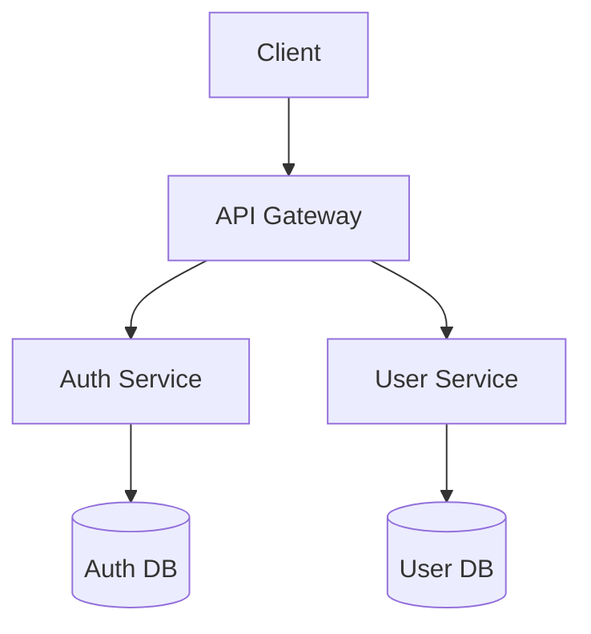
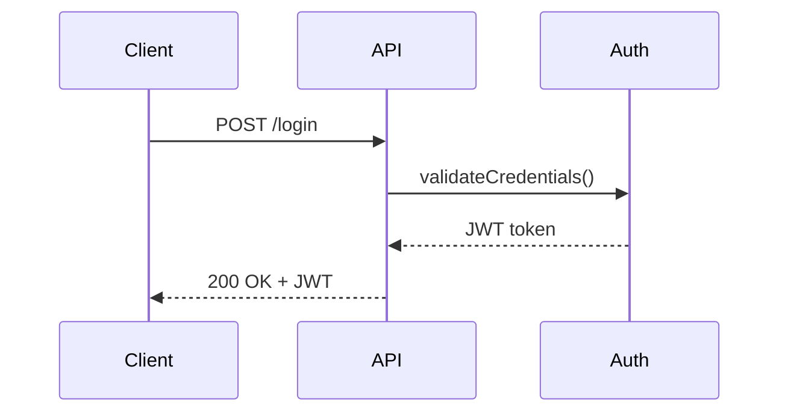

# Skill: Diagram Generation

## Purpose

Produce clear, accurate diagrams that reduce the cognitive load of understanding a system or process.

## Workflow

### Step 1 — Identify diagram type

| Use case | Diagram type |
|---|---|
| System components and connections | Architecture diagram |
| Process or workflow | Flowchart |
| State machine | State diagram |
| Data relationships | ER diagram |
| Sequence of calls | Sequence diagram |
| Class hierarchy | Class diagram |
| Timeline | Gantt |

### Step 2 — Gather inputs

Identify:
- All nodes (components, systems, entities)
- All edges (relationships, calls, data flows)
- Direction and cardinality of relationships
- Any groupings or boundaries (layers, services, teams)

### Step 3 — Choose format

Preferred formats (in order):
1. **Mermaid** — renders in GitHub, Notion, most markdown tools
2. **PlantUML** — for complex UML diagrams
3. **ASCII** — for simple diagrams in terminal-friendly docs
4. **SVG/PNG** — for polished output when tooling is available

### Step 4 — Generate diagram source

Mermaid example (architecture):


Mermaid example (sequence):


### Step 5 — Validate

Check:
- Does it accurately represent the described system?
- Are all relevant nodes present?
- Are there any crossed wires or misleading connections?
- Is it readable at the intended display size?

### Step 6 — Write description

`state/tasks/<id>/outputs/diagram-description.md`:
```markdown
# Diagram: <title>
Type: <type>
Format: <format>
File: <path>
Description: <what it shows>
Key elements:
  - <node>: <what it represents>
Limitations:
  - <what it doesn't show>
```

## Do

- Keep diagrams focused — one concept per diagram
- Label all edges with relationship or data type
- Use consistent notation throughout the repo

## Don't

- Don't create a diagram for every document — use when it genuinely aids understanding
- Don't generate diagrams that contradict the written documentation
- Don't use diagrams as a substitute for explaining the system in prose
